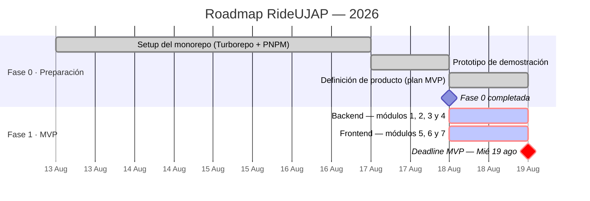

# 🗺️ Roadmap — RideUJAP

> Carpooling universitario para la comunidad de la Universidad José Antonio Páez ([ujap.edu.ve](https://ujap.edu.ve)).
> Un conductor que ya va a la universidad comparte los puestos libres de su carro con estudiantes de zonas cercanas, reparte gastos y recibe una comisión por el servicio.
> Modelo de referencia: [BlaBlaCar Daily](https://blablacardaily.com).

**Última actualización:** 18 de agosto de 2026

---

## Cómo leer la numeración

El roadmap sigue **la numeración de fases del [plan MVP](./PLAN-MVP-MOVILIDAD-UJAP.md)**, que es la que usan los issues en desarrollo:

- **Fase 0** agrupa todo el trabajo previo al MVP (setup del monorepo, prototipo de demostración y definición de producto). Antes se documentaba como Fases 1, 2 y 3.
- **Fase 1** es el MVP.
- **Fases 2 y 3** son los horizontes de producto definidos en la sección 4 del plan.

Si encuentras una referencia a "la Fase 2" en un documento viejo hablando del prototipo, se refiere a lo que hoy es la [Fase 0](./00-FASE-PREPARACION.md).

---

## Tech Stack

| Capa | Tecnología | Documentación oficial |
|---|---|---|
| **App móvil** | React Native (con Expo) | [docs.expo.dev](https://docs.expo.dev) · [reactnative.dev](https://reactnative.dev/docs/getting-started) |
| | TypeScript | [typescriptlang.org/docs](https://www.typescriptlang.org/docs/) |
| | Expo Router (navegación file-based) | [docs.expo.dev/router](https://docs.expo.dev/router/introduction/) |
| | NativeWind + Tailwind CSS | [nativewind.dev](https://www.nativewind.dev/) |
| **Backend** | TypeScript + Fastify | [fastify.dev/docs](https://fastify.dev/docs/latest/) |
| | Better Auth (+ adapter de Drizzle) | [better-auth.com/docs](https://www.better-auth.com/docs) |
| | Drizzle ORM | [orm.drizzle.team/docs](https://orm.drizzle.team/docs/overview) |
| | PostgreSQL | [postgresql.org/docs](https://www.postgresql.org/docs/) |
| **Geolocalización** | Haversine local (sin librería de mapas). UJAP como coordenada fija | — |
| | Geocoding del punto del estudiante: `[POR DEFINIR]` | — |
| **Contacto** | Deep link a WhatsApp (`wa.me`) | [faq.whatsapp.com](https://faq.whatsapp.com/5913398998672934) |
| **Deploy** | `[POR DEFINIR]`: Railway o Render | [docs.railway.com](https://docs.railway.com) · [render.com/docs](https://render.com/docs) |
| **Arquitectura** | Monorepo multipaquete con Turborepo | [turborepo.com/docs](https://turborepo.com/docs) |
| | PNPM (workspaces) | [pnpm.io/workspaces](https://pnpm.io/workspaces) |
| **Calidad** | ESLint + Prettier · Husky + lint-staged + Commitlint | [commitlint.js.org](https://commitlint.js.org/) |

---

## Fases

### Fase 0 — Preparación ✅
**Completada: 13 – 18 de agosto de 2026** · 📄 [Detalle](./00-FASE-PREPARACION.md)

Migración del template Vue a un monorepo Turborepo + PNPM, prototipo navegable entregado al cliente (pantalla de inicio, tabs, placeholder de mapa y un endpoint real con datos semilla) y definición del concepto de producto.

**Entregable:** monorepo funcional, demo presentable y el [plan MVP](./PLAN-MVP-MOVILIDAD-UJAP.md) como especificación del producto.

---

### Fase 1 — MVP de Movilidad 🚧
**Deadline: Miércoles 19 de agosto de 2026** · 📄 [Plan de ejecución](./01-FASE-MVP.md)

El flujo completo de punta a punta: **publicar → buscar → reservar → contactar por WhatsApp → calificar**. Se reparte en cuatro módulos (Auth y Schema Base, Usuarios, Viajes, Reservas), cada uno con issue de backend y de frontend.

Sin matching por horario, sin tracking en vivo y sin pagos in-app: el objetivo es validar que el concepto funciona y que la gente lo usa, no construir el producto final.

**Entregable:** app probada con estudiantes reales.

---

### Fase 2 — Horarios, tracking y seguridad 🔭
**Sin fecha** · 📄 [Detalle](./02-FASE-HORARIOS.md)

El diferenciador real: matching por horario de clases, viaje ida+vuelta pre-armado, viajes recurrentes, tracking en vivo, compartir viaje con un contacto, botón de pánico y verificación con correo institucional.

**Precondición:** que el MVP haya demostrado tener conductores y pasajeros dispuestos.

---

### Fase 3 — Líneas, chat y pagos 🔭
**Sin fecha** · 📄 [Detalle](./03-FASE-LINEAS-PAGOS.md)

La fase de escala: modelo de líneas por zona, matching multi-pasajero optimizado, chat interno y pago dentro de la app.

**Precondición:** volumen de usuarios suficiente por zona.

---

## Vista rápida

| Fase | Estado | Fechas |
|---|---|---|
| 0. Preparación | ✅ Completada | 13 – 18 ago 2026 |
| 1. MVP de Movilidad | 🚧 En curso | 18 ago 2026 → **Mié 19 ago 2026** |
| 2. Horarios, tracking y seguridad | 🔭 Horizonte | Sin fecha |
| 3. Líneas, chat y pagos | 🔭 Horizonte | Sin fecha |

> ⚠️ **La Fase 1 se entrega en ~24 horas con 7 issues abiertos.** El único orden posible es el grafo de dependencias: #1 primero, luego #2 y #3 en paralelo, después #4, y el frontend detrás de cada uno. El [plan de ejecución](./01-FASE-MVP.md) incluye el punto de corte por módulo y qué recortar si el tiempo se acaba.

> La Fase 1 entra completa en un solo día: backend y frontend avanzan en paralelo, cada módulo de interfaz detrás del endpoint que consume. El reparto módulo a módulo está en el [plan de ejecución](./01-FASE-MVP.md).
