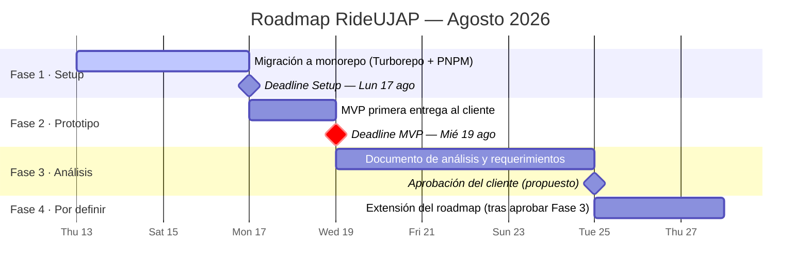

# 🗺️ Roadmap — RideUJAP

> Aplicación móvil de viajes compartidos para la comunidad de la Universidad José Antonio Páez ([ujap.edu.ve](https://ujap.edu.ve)).
> Referentes del mercado venezolano: [Ridery](https://web.ridery.app) y [Yummy Rides](https://www.yummysuperapp.com/rides).

**Última actualización:** 13 de agosto de 2026

---

## Tech Stack

| Capa | Tecnología | Documentación oficial |
|---|---|---|
| **Frontend** | React Native (con Expo) | [docs.expo.dev](https://docs.expo.dev) · [reactnative.dev](https://reactnative.dev/docs/getting-started) |
| | TypeScript | [typescriptlang.org/docs](https://www.typescriptlang.org/docs/) |
| | Librería de mapas | `[POR DEFINIR]` — ver candidatas en la Fase 2 |
| **Backend** | TypeScript + Fastify | [fastify.dev/docs](https://fastify.dev/docs/latest/) |
| | Drizzle ORM | [orm.drizzle.team/docs](https://orm.drizzle.team/docs/overview) |
| | PostgreSQL | [postgresql.org/docs](https://www.postgresql.org/docs/) |
| **Deploy** | `[POR DEFINIR]`: Railway o Render | [docs.railway.com](https://docs.railway.com) · [render.com/docs](https://render.com/docs) |
| **Arquitectura** | Monorepo multipaquete con Turborepo | [turborepo.com/docs](https://turborepo.com/docs) |
| | PNPM (workspaces) | [pnpm.io/workspaces](https://pnpm.io/workspaces) |

---

## Fases

### Fase 1 — Setup del monorepo
**Deadline: Lunes 17 de agosto de 2026** · 📄 [Plan detallado](./01-FASE-SETUP.md)

Migrar el template existente de Vue.js (RideUjap) a la nueva arquitectura de monorepo con Turborepo + PNPM. El template Vue funciona como referencia de diseño/UX (pantalla de inicio, navbar inferior, componentes de input y botón), pero el destino es React Native con Expo. Al cierre de esta fase el equipo debe poder clonar el repo, instalar con `pnpm` y levantar app y API localmente.

**Entregable:** monorepo funcional con `apps/mobile`, `apps/api` y paquetes compartidos.

---

### Fase 2 — Prototipo (MVP)
**Deadline: Miércoles 19 de agosto de 2026** · 📄 [Plan detallado](./02-FASE-PROTOTIPO-MVP.md)

Construir el MVP para la primera entrega al cliente: replicar en React Native el flujo del template Vue (inicio → buscar viaje → navegación inferior), conectar con un endpoint básico de Fastify y dejar un placeholder visual para el mapa. El objetivo es demostrar el flujo, no completar funcionalidad.

**Entregable:** build de demostración navegable (Expo Go / development build) presentable al cliente.

---

### Fase 3 — Análisis y requerimientos iniciales
**Sin deadline definido (propuesto: semana del 20–26 de agosto)** · 📄 [Plan detallado](./03-FASE-ANALISIS-REQUERIMIENTOS.md)

Producir el documento de análisis de producto: usuarios objetivo (estudiantes/profesores UJAP), benchmark contra Ridery y Yummy Rides, y consideraciones propias del contexto venezolano — en especial el manejo de tarifas con la tasa oficial del [BCV](https://www.bcv.org.ve), pagos en Bs/USD y conectividad móvil.

**Entregable:** documento de requerimientos aprobado por el cliente, que alimenta la Fase 4.

---

### Fase 4 — `[POR DEFINIR]`
📄 [Plan detallado](./04-FASE-POR-DEFINIR.md)

Se definirá una vez aprobado el análisis de la Fase 3. Candidatos naturales: autenticación con correo institucional, integración real del mapa, publicación/búsqueda de viajes con datos reales, y decisión final de deploy (Railway vs Render).

---

## Vista rápida de deadlines

| Fase | Inicio estimado | Deadline |
|---|---|---|
| 1. Setup monorepo | Jue 13 ago | **Lun 17 ago** |
| 2. Prototipo MVP | Lun 17 ago | **Mié 19 ago** |
| 3. Análisis y requerimientos | Mié 19 ago | Propuesto: Mar 25 ago |
| 4. Por definir | Tras aprobar Fase 3 | — |

> ⚠️ **Nota de riesgo:** entre el deadline de la Fase 1 (lunes) y el de la Fase 2 (miércoles) hay solo 2 días hábiles. Se recomienda adelantar trabajo del MVP en paralelo al setup (por ejemplo, definir pantallas y contratos de API en papel mientras se migra el repo).

El diagrama de Gantt correspondiente:

